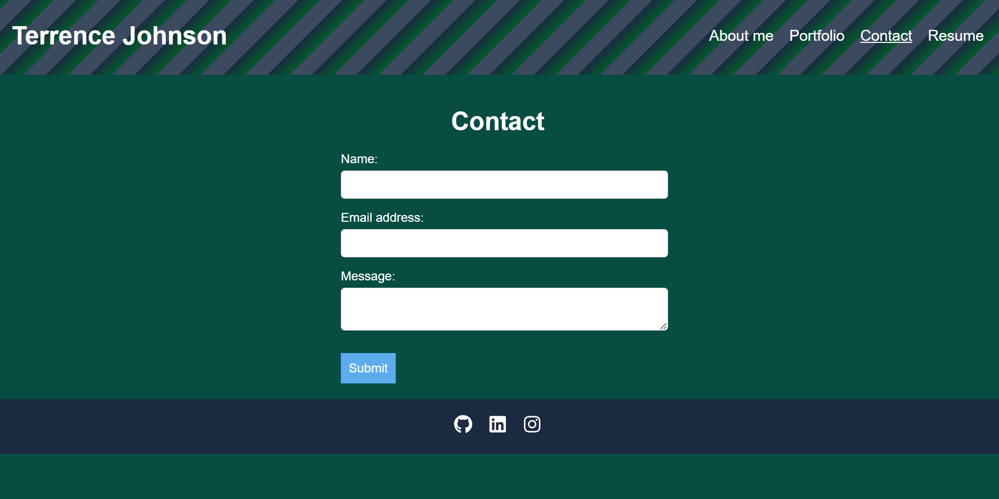

# React-Portfolio

  
  

 
 
  ## Demo 
  https://react-portfolio-terry.netlify.app
  
 
  
  
  
  ## Table of Contents
  * [Description](#description)
  * [Installation](#installation)
  * [Usage](#usage)
  * [Tests](#tests)
  * [Contributing](#contributing)
  * [License](#license)
  * [Contact Me](#contact-me)
  
  ## Description 
  This project is a personal portfolio website built with React. It showcases various projects and provides information about the developer. The portfolio includes sections for an about me, contact information, and a gallery of projects with images and descriptions. The website is styled with CSS and is fully responsive, ensuring it looks great on all devices.

## Installation

1. Clone the repository:
git clone https://github.com/terrencejsr/React-Portfolio.git
cd React-Portfolio
   

2. Install the dependencies:
npm install
   

4. Open your browser and navigate to `http://localhost:3000` to view the portfolio.

  ## Usage 
  1. Start the application:
  npm start

  2. Open your browser and navigate to http://localhost:3000 to view the portfolio.

  3. Explore the different sections of the portfolio, including the about me, contact information, and project gallery.

  ## Tests 
  N/A
  
  
  ## Contributing 
  Contributions are welcome! If you would like to contribute to this project, please follow these steps:

  1. Fork the repository.
  2. Create a new branch (`git checkout -b feature/YourFeature`).
  3. Make your changes and commit them (`git commit -m 'Add some feature'`).
  4. Push to the branch (`git push origin feature/YourFeature`).
  5. Open a pull request.

  Please make sure your code follows the project's coding standards.

  Thank you for your contributions!

  ## License 
  MIT
  

  ## Contact Me:
  * Github: terrencethe1
  * Email: terrence.jsr@gmail.com
  
  
